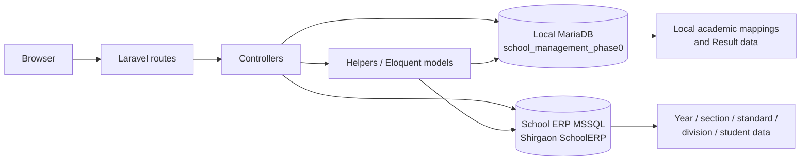
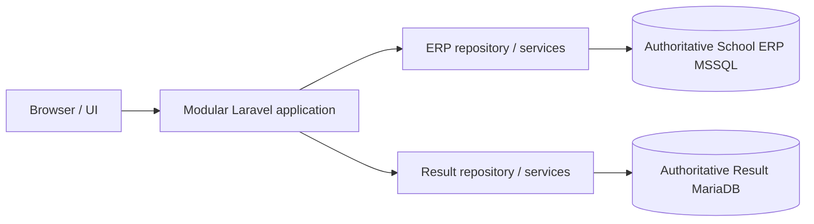

# Current data-source map

This describes current code paths, not the frozen target architecture.

## Local Phase 0 verification boundary

The remote testing deployment is not connected or inspectable. Local Laravel configuration points to MariaDB database `school_management_phase0`; live SELECT-only counts match the designated SQL source across all 18 checked tables. Windows Integrated Authentication to MSSQL database `Shirgaon SchoolERP` is verified through both `sqlcmd` and Laravel's `sqlsrv_olderp` connection; SELECT-only counts were successfully read from `SubStudentMst`, `FeeMstStudent`, `StandardMst`, and `DivisionMst`.

## Current actual dependency flow

Direct controller/helper-to-database coupling is current behavior, not the future design.

| Domain | Current source/read path | Current write path | Confidence |
|---|---|---|---|
| Year and section selection | Live MSSQL via `SubStudentMst` on `sqlsrv_olderp`; distinct `yearid`/`sectionid`; section display names are hard-coded | Session keys `yearid`, `sectionid`, `year_name`, `section_name` | Source observed; MSSQL table read verified |
| Standards | Local `standards` plus `standard_year_mappings`; some direct MSSQL model access also exists | Local MariaDB administration/mapping paths | Observed in controllers/helpers/models |
| Divisions | Local `divisions` plus `division_year_mappings`, translated by year, old standard ID, and normalized division name to MSSQL `DivisionMst` | Local MariaDB administration/mapping paths | Observed in `app/Helpers/StudentHelper.php` and models |
| Students | Principal active lookup is live MSSQL `SubStudentMst`, joined with `FeeMstStudent` | Two authenticated GET sync routes can populate/update local mirrored data; they were not invoked | Observed in `StudentHelper` and route/controller inventory |
| Local student mirrors | `erp_student_master` and SQL-dump tables such as `substudentmst`/`feemststudent` remain and are used by some report/sync paths | Local MariaDB sync/import paths | Observed; live freshness unknown |
| Subjects and standard mapping | MariaDB `subjects`, `standard_wise_subjects` | MariaDB | Observed |
| Exams, allocations, marks, status, results | MariaDB Result Management tables | MariaDB | Observed |
| Result register/report card | Mixed local-table joins remain in these paths | Read/report generation paths | Observed; current live correctness not verified |

## Session convention

Academic context is stored under `yearid`, `sectionid`, `year_name`, and `section_name`. `CheckSchoolSession` logs an authenticated user out only when both `yearid` and `sectionid` are absent; this is an observed current condition, not a recommendation.

## Frozen future target

The agreed future target makes MSSQL authoritative for academic year, section, standard, division, student, GR, and related student information, while MariaDB remains authoritative for Result Management data. No target-architecture change was implemented in Phase 0.

Detailed translation evidence is in `current-local-to-mssql-mapping.md`.
